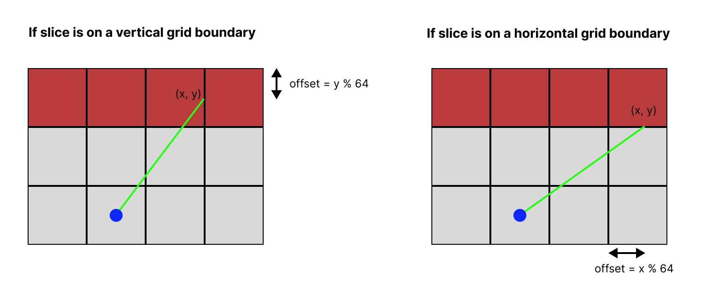

<div align="center">

# cub3D
#### My first RayCaster with miniLibX


</div>

## About

This project was carried out as part of the [School 42](https://42.fr/en/homepage/) Common Core. Inspired by the world-famous Wolfenstein 3D game, the aim of this project is to discover raycasting.

## Authors

| Author | GitHub profile |
| - | - |
| Samuel Vanmeenen Bachelard (svanmeen) | [@Lyptis](https://github.com/Lyptis) |
| Camille Bernot (cbernot) | [@RhesusP](https://github.com/RhesusP) | 

## Subject

The program takes a `.cub` map as parameter and display this map using raycasting. The map must include the following composants : 

| Identifier | Meaning |
| :-: | - |
| `SO` | Texture path for the south face of a wall  |
| `NO` | Texture path for the north face of a wall |
| `EA` | Texture path for the east face of a wall |
| `WE` | Texture path for the west face of a wall |
| `C` | Ceiling color (r,g,b) |
| `F` | Floor color (r,g,b) |
| `0...1` | Map description composed only of 1 (wall) and 0 (void/floor) |

There is also some rules :
- File passed as parameter must have `.cub` extension
- Map description must include the player's starting position (`N`, `S`, `E`, `W`, depending of the player starting orientation) 
- Map despcription msut be surronded by walls
- Except for the map content, each type of element can be separated by one or more empty line(s).
- Except for the map content which always has to be the last, each type of
element can be set in any order in the file.
- Except for the map, each type of information from an element can be separated by one or more space(s).

For example, here is a valid map :
```txt
NO ./path_to_the_north_texture
SO ./path_to_the_south_texture
WE ./path_to_the_west_texture
EA ./path_to_the_east_texture

F 220,100,0
C 225,30,0

        1111111111111111111111111
        1000000000110000000000001
        1011000001110000000000001
        1001000000000000000000001
111111111011000001110000000000001
100000000011000001110111111111111
11110111111111011100000010001
11110111111111011101010010001
11000000110101011100000010001
10000000000000001100000010001
10000000000000001101010010001
11000001110101011111011110N0111
11110111 1110101 101111010001
11111111 1111111 111111111111
```

## Usage

The game runs on Linux and uses [MinilibX](https://github.com/42Paris/minilibx-linux). You can launch it with the following command :
```bash
# Mandatory part :
make && ./cub3D path_to_map

# Bonus part (including minimap)
make bonus && ./cub3D_bonus path_to_map
```

### Keys

| Key | Description |
| :-: | - |
| `W` | Move forward |
| `A` | Move left |
| `S` | Move backward |
| `D` | Move right |
| `➡️` | Rotate left |
| `⬅️` | Rotate right |
| `ESC` | Quit the program |

## How does it works ?

### Parsing

Parsed data are stored in these three structures : 
```c
typedef struct s_text
{
	void		*img;
	char		*addr;
	int			bits_per_pixel;
	int			line_length;
	int			endian;
	int			width;
	int			height;
	int			is_init;
}	t_text;

typedef struct s_player
{
	t_point	map_pos;
	double	dir;
	double	speed;
}	t_player;

typedef struct s_map_info
{
	void		*mlx;
	void		*mlx_win;
	t_mlx_data	mlx_img;
	t_text		*no_texture;
	t_text		*so_texture;
	t_text		*we_texture;
	t_text		*ea_texture;
	int		floor_color;
	int		ceiling_color;
	int		map_width;
	int		map_height;
	char		**map;
	t_frame		*frame;
	t_player	player;
}	t_map_info;
```


### Raycasting

Raycasting is a pseudo 3-dimensional rendering technique that are very popular in game development arena in the 90s (Doom, Wolfenstein 3D).

Raycasting is a technique that transform a limited form of data (a very simplified 2D map) into a 3D (also called 2,5D) projection by tracing rays from the view pooint into the viewing volume 

| 2D map | 3D representation |
| - | - |
|  |  |


Raycasting is fast because it utilizes some geometric constraints. In most cases, walls are always at 90 degrees angle with the floor, viewpoint cannot be rotated along the Z axis and floor is flat.

### Constants

To compute the image to display, we need some constants

```c
# define CUBE_SIZE 64		// Size of a cube in our world
# define MINI_SIZE 8		// Size of a cube in the minimap
# define FOV 60			// Field Of View
# define HALF_FOV 30
# define PLAYER_HEIGHT 32
# define PROJECTION_DISTANCE 1108
# define HEIGHT 720		// Screen height
# define WIDTH 1280		// Screen width
# define NB_RAYS 640
# define SPEED 10.0		// Player moving speed 
# define ROT_SPEED 0.06		// Player rotation speed

# define DEG_RAD 0.017453
# define RAD_DEG 57.295780
# define ANGLE_INCR 0.001636
# define TWO_PI 6.283185
# define PI_3_2 4.712389
```

We set the FOV and the projection plane (screen) dimensions, we can calculate the **angle between subsequent rays** and the **distance between the player and the projection plane**.

<div align="center">


</div>
* Distance between player and projection plane (`PROJECTION_DISTANCE`) :
$$ distance = {\frac{width / 2}{tan(FOV / 2)}} $$
$$ distance = {\frac{640}{tan(30) * \pi / 180}} $$


> **Note**:
> We work with radian angles.

* Angle between subsequent rays (`ANGLE_INCR`) : 

$$ increment = {\frac{FOV}{width / 2} * \pi / 180} $$ 
$$ increment = \frac{60}{640} * \pi / 180 = 0.001636 $$ 

> **Note**:
> The real formula is $increment=\frac{FOV}{width}$ but here, we divide the width by 2 to launch a ray every two columns.

### Finding walls

To find walls and distance between them and the player, we use the DDA (Digital Differential Analyzer) algorithm.
Steps are the followings : 
```
1- Get the player orientation
2- Substract FOV / 2 to player orientation
3- Cast a ray traces it until it hits a wall
4- Record the distance between the player and the wall hit
5- Add angle increment (0.001636 rad) to throw the next ray
6- Repeat from step 3 until ray orientation is player orientation + (FOV / 2)
```

Check each pixel on the ray to find a wall is very costly. The trick is to check each grid (because a wall can only appear on a grid boundary).
For example :
<div align="center">


</div>

So, for each ray, we will : 
- check horizontal axis
- check vertical axis
- save the shortest distance between horizontal and vertical axis

### Horizontal intersections


Here, we have
$$ Xa=\frac{64}{tan(\alpha)} $$

Now, that we know Xa and Ya, we just need to calculates the x and y difference between the player and the first horizontal grid point (the difference between Px and Ax and Py and Ay on the illustration above).

If the ray is facing up :
$$ Ay = floor(\frac{Py}{64}) * 64 - 1 $$
If the ray is facing down :
$$ Ay = floor(\frac{Py}{64}) * 64 - 64 $$

Then : 
$$ Ax = Px + \frac{Py - Ay}{tan(\alpha)} $$

Now that we have the first point on horizontal axis, we can find other points by incrementing Ax and Ay by Xa and Ya.

### Vertical intersections


Here, we have
$$ Ya=64 * tan(\alpha) $$ 

Now, that we know Xa and Ya, we just need to calculates the x and y difference between the player and the first horizontal grid point (the difference between Px and Bx and Py and By on the illustration above).

If the ray is facing right :
$$ Bx = floor(\frac{Px}{64}) * 64 + 64 $$
If the ray is facing left :
$$ Bx = floor(\frac{Px}{64}) * 64 - 1 $$

Then :
$$ By = Py + (Px - Bx) * tan(\alpha) $$

Now that we have the first point on vertical axis, we can find other points by incrementing Ax and Ay by Xa and Ya.

### Finding distance between player and walls

Coordinates of walls hitting by a ray a stored in the following structure
```c
typedef struct s_frame
{
	t_point		point;
	float		distance;
	double		angle;
	float		height;
	int			axis;
	enum e_side	wall_face;
}	t_frame;
```
So, each `t_frame` representing a column (or a slice) of the screen
The distance to the wall can be calculates with the following formula : 
Let (Px, Py) be the player coordinates and (Ax, Ay) the wall coordinates found with the DDA algorithm :
$$ Distance = \sqrt{(Px - Ax)² + (Py - Ay)²} $$

> **Avoid fishbowl effect**:
> To avoid distorsion, we need to multiply the distance by the cosine of the ray angle : 
>  $$ corrected\ distance = distorded\ distance * cos(\alpha) $$


### Drawing Walls

We now have the distance and coordinates of the walls the player sees. In order to draw the walls, we need to calculate their height.
Each wall is splited in slices. We can deduce the height of a slice with this formula : 
$$ Projected\ slice\ height = \frac{Actual\ slice\ height}{Distance\ to\ the\ slice} * Distance\ to\ the\ projection\ plane $$
In our case, we have :
$$ Projected\ slice\ height = \frac{64}{Distance\ to\ the\ slice} * 1108 $$

Now that we know the height of the slice, we can start to draw untextured walls. For example, if the height of our projection plane is 720 and the height of the slice is 300, we can draw our entire slice (ceil + wall + floor) by centering the wall fill the top of the wall (ceil) and bottom of the wall (floor) with the appropriate colors described in our `.cub` file.


### Textured walls

To associate a texture with a wall, we use a technique called **texture mapping**. This technique works by scalling a slice of a bitmap.

Thanks to wall coordinates stored in our `t_frame` structure, we can deduces where the current slice is in our bitmap. To deduce that, we use modulo.



Here is the function that put the texture to the wall.

```c
static void	draw_texture_col(t_map_info *map, t_frame frame, int x, int offset)
{
	float	scale;
	int	texture_x_offset;
	t_text	*texture;
	float	text_y;
	int	y;

	texture = get_texture(map, frame.wall_face);
	scale = texture->height / frame.height;
	if (frame.axis == 1)
		texture_x_offset = frame.point.y % CUBE_SIZE;
	else
		texture_x_offset = frame.point.x % CUBE_SIZE;
	text_y = 0;
	if (frame.height > HEIGHT)
		text_y = ((frame.height - HEIGHT) / 2) * scale;
	y = 0;
	while (y < frame.height)
	{
		ft_mlx_pixel_put(&map->mlx_img, x, y + offset, \
			get_texture_color(texture, texture_x_offset, \
			(int)text_y % texture->height));
		text_y += scale;
		y++;
	}
}
```

## Useful links

[JavaScript RayCasting tutoriel](https://github.com/vinibiavatti1/RayCastingTutorial/wiki/Home)  
[Permadi RayCasting tutorial](https://permadi.com/1996/05/ray-casting-tutorial-table-of-contents/)  
[Raycasting PICO-8#4 - The Theory by Blog Création de Jeux Vidéo](https://youtu.be/ZAlMicFhHmM)  
[Do your own raycaster by 3DSage](https://www.youtube.com/watch?v=gYRrGTC7GtA)  
[Sprites database](https://spritedatabase.net/system/pc)  
[Cub3d tutorial](https://website-b-bischoff.vercel.app/cube3d)